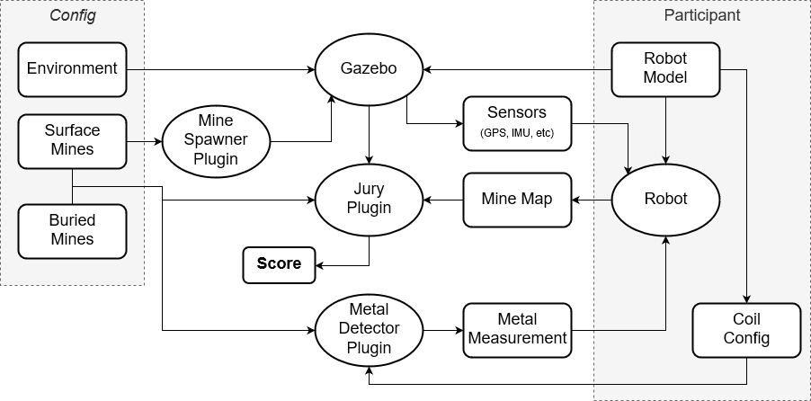

# Minesweepers Gazebo

Gazebo simulation framework for the [Minesweepers](https://landminefree.org) competition. This repository contains the ROS environment and Gazebo plugins to run the simulation of the competition.


## Dependencies

* [Husky](https://github.com/husky/husky) from Clearpath.

* [Metal Detector model](https://github.com/ras-sight/metal_detector_msgs) from HRATC competition.

## Environment

Please add the `models` directory to the `GAZEBO_MODEL_PATH` environment variable. You can add the path in your `.bashrc`:

```bash
export GAZEBO_MODEL_PATH=$PATH_TO_MINESWEEPERS_GAZEBO/models:$GAZEBO_MODEL_PATH
```
## Architecture

Please check the below diagram, where there are two highlighted zones:
* "Config" zone represents the configuration files which are only known by the organizers, such as the simulation environment and the location of the mines.
* "Participant" zone includes the components that must be produced by the participant teams. This includes the robot model for gazebo, the robot ROS nodes to execute their algorithms and the metal detector coil configuration, which is used by the metal detector plugin, in order to know how many coils has the robot and their location. 



## Issues ##
Find a bug or want to request a new feature? Please let us know by [submitting an issue](https://github.com/landminefree/minesweepers_gazebo/issues).

## Contributing ##
Anyone and everyone is welcome to contribute.

This project is maintained by [**Francisco Miguel Moreno**](mailto:franmore@ing.uc3m.es).
